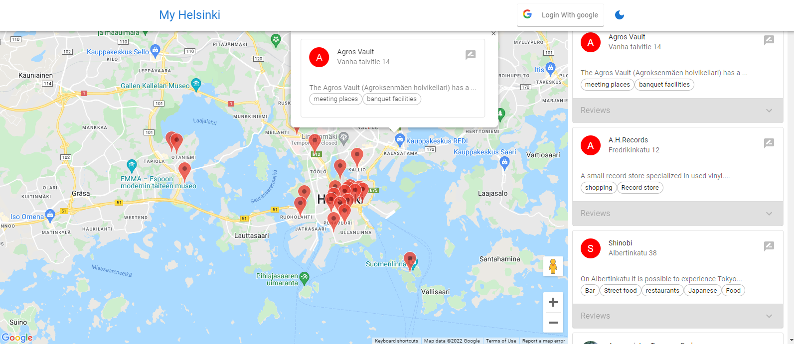

# [MyHelinki Map Platform]()

# Description

Fullstack platform built with Reactjs, Express, MongoDB & Reduxtoolkit. This app includes profiles, authentication, places, reviews, and many more features. Users can view places on the map, log in with google, and login user can review, deleted, and update their own reviews.

ps. this project is an expanded solution to this [requirements](./requirements.MD)

## Features

- Place reviews and ratings
- Map with places markers
- InfoWindow with place details
- Login with google
- User profile with reviews
- Review places
- delete reviews
- and more...

<br>

<p align="center">

- Demo before login

</p>

<p align="center">

- Demo After login

</p>

## Live demo

A live demo of the app is hosted on Heroku.

_Due to demo reasons and Heroku free terms, if an app receives no web traffic in a 30-minute period, it will sleep. Therefore, during the first launch, the application may take longer to load than usual, approximately 15 - 20 seconds. So please be patient and wait for the app to launch. Subsequent launches will be relatively fast._

## Technology stack

> ### FrontEnd
>
> - React
> - React Hooks
> - React router
> - Redux Toolkit
> - Mui
> - TypeScript
>   <br>

> ### BackEnd
>
> - Node
> - Express
> - JWT
> - MongoDB with mongoose
> - Heroku hosting
>   <br>

## Usage

Clone this repository to the desired location

```Shell
git clone https://github.com/v-limo/MyHelsinki.git
```

<br>

### Env Variables

Create a .env file in the root and add the following

```
NODE_ENV = development
PORT = 5000
SECRET_KEY = your secret key
MONGO_URI = your mongodb uri
CLIENT_ID = your google client id
CLIENT_SECRET =  your google client secret

```

cd to frontend, create a .env file in the root

```
cd frontend
```

and add the following

```

REACT_APP_API_KEY = google api key
REACT_APP_API_GOOGLE_CLIENT_ID = google client id
REACT_APP_CLIENT_ID=  google client id

```

### Install Dependencies (frontend & backend)

```
npm install
cd frontend
npm install

```

### Run

```
# Run frontend (:3000) & backend (:5000)
npm run dev
```

```
# Run backend only
npm run server
```

```
# Run frontend only
npm run client
```

## Build & Deploy

```
# Create frontend prod build
cd frontend
npm run build
```

### Contributing

Contributions are highly appreciated. In general, I follow the "fork-and-pull" Git workflow.

1. **Fork** this repo
2. **Clone** the project to your own machine
3. **Commit** changes to your own branch
4. **Push** your work back up to your fork
5. **Submit** a Pull request so that I can review your changes

**NOTE:** Be sure to merge the latest from "upstream" before making a pull request!

### License

MIT license
